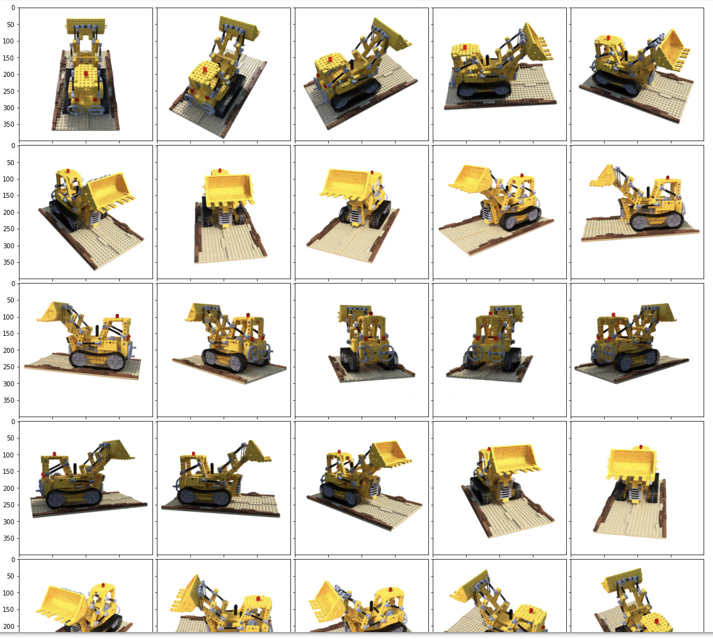
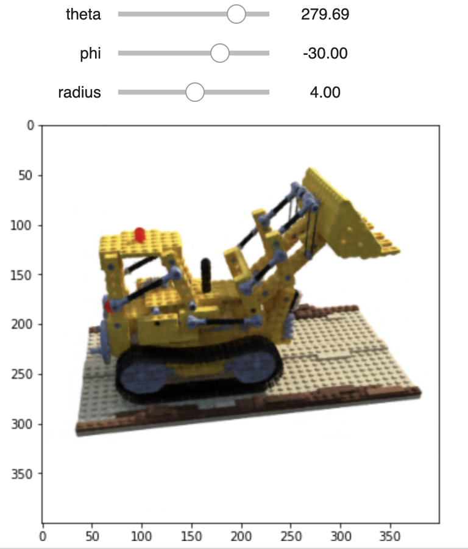

# Mini-NeRF
This repository presents a lightweight version of NeRF, which is trainable within 5 hours on Google Colab. Pre-trained checkpoints and Colab scripts are provided. It is useful for people new to NeRF to get a quick sense of what NeRF is. 

## Three features are included in this project.

### 1. Accessible to Everyone
The original model is hard to train on laptops or computers without strong GPUs. Mini-NeRF eliminate the inaccessibility of NeRF, anyone with a google account will have access to Colab and Mini-NeRF can be trained on free GPUs provided by Colab.

### 2. Visualization Cells
The training result can also be easily viewed on Colab, the visualization code cells are also included in the scripts.

https://user-images.githubusercontent.com/93879365/216383290-4992d897-b325-40e9-8874-cf888434429a.mp4

### 3. Interactive Interface
An interactive visualization interface is also provided for user to view customized angles of the synthesized object.

## Installation
1. Clone this repo `git clone https://github.com/ChunHsuehLee/Mini-Nerf.git`
2. Upload the whole folder to your google drive.
3. (Optional) Use the pre-trained checkpoints. Download the checkpoints [here](https://drive.google.com/drive/folders/10v4PNFlCHuSZLlXtWpl3IXoBUi6355-L
), upload the whole folder (include `logs`) to the `Mini-Nerf` folder you just uploaded.
4. Run the Colab script (.ipynb file) cell by cell.
5. Have fun!

## References
Thank [yenchenlin](https://github.com/yenchenlin/nerf-pytorch) and [bmild](https://github.com/bmild/nerf) for their super useful repos!

